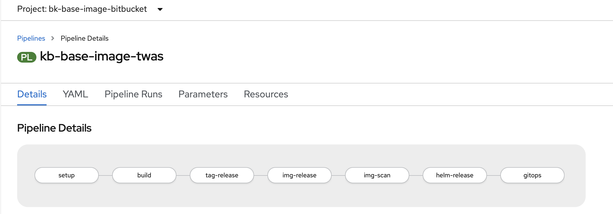

# Create your custom Base Java Container Image from Open Liberty

In this sample repo, you will create your custom base Java container image from `Open Liberty` container image `openliberty/open-liberty:kernel-slim-java8-openj9-ubi` in a OpenShift cluster running in IBM Cloud environment. 

This custom base Java container image provides a uniformed starting point for deploying Java applications running on [Open Liberty](https://openliberty.io/) in your organization. 

You are going to create your base image via a tekton pipeline deployed in OpenShift cluster. The pipeline helps you create the base image through a series of tasks.
- setup
- build
- tag-release
- img-release
- img-scan
- helm-release
- gitops



You can add, remove and modify the tasks in the sample pipeline based on your requirements.


## Pre-requisites

This repo was based on the [Cloud-native toolkit](https://cloudnativetoolkit.dev). 
- `Cloud-native toolkit` must be deployed in your OpenShift cluster. 
- `Cloud-native toolkit CLI` must be installed in your terminal/command window environment

Installation instruction of `Cloud-native toolkit` is available at https://cloudnativetoolkit.dev/getting-started-day-0.


## Steps

You will create your custom base Java container image in a OpenShift cluster running in IBM Cloud environment. 


### Step 1. Set up local development environment

CLI tools of various open source projects will be used while creating your base container image. 

To enhance the user experience, a simplified installer will be used to install tools and configure the shell environment. The installer will first check if the required tool is available in the path. If not, the missing tool(s) will be installed into the bin/ folder of the current user’s home directory and the PATH variable will be updated in the .bashrc or .zshrc file to include that directory.

The following tools are included in the shell installer:

- IBM Cloud cli (ibmcloud)
- ArgoCD cli (argocd)
- Tekton cli (tkn)
- IBM Cloud fast switching (icc)
- kube-ps1 prompt
- OpenShift cli (oc)
- Kubernetes cli (kubectl)
- JSON cli (jq)
- IBM Garage Cloud CLI (igc)

1. Open a terminal or command window.

1. Set up the shell environment.

    ```
    curl -sL shell.cloudnativetoolkit.dev | bash - 
    
    source ~/.bashrc || source ~/.zshrc
    ```

1. After CLI tools are successfully installed, you should see similar output as below.

    ```
    Downloading scripts: https://github.com/cloud-native-toolkit/cloud-shell-commands/releases/download/0.3.5/assets.tar.gz
    ** Installing argocd cli
    ** Installing tkn cli
    ** Installing kube-ps1
    ** Installing icc
    ** Installing Cloud-Native Toolkit cli

    kube-ps1 has been installed to display the current Kubernetes context and namespace in the prompt. It can be turned on and off with the following commands:
    ```

1. Follow the instruction given at the end of the output to enable the changes in the current terminal session.

1. Verify the shell was installed correctly by checking the oc sync version.

    ```
    oc sync --version
    ```

### Step 2. Clone the repo

1. Setup environment variable.

    ```
    export GIT_URL=https://github.com/lee-zhg/base-image-liberty
    ```

1. Clone the repo locally.

    ```
    git clone $GIT_URL

    cd base-image-liberty
    ```

### Step 3. Login to OpenShift cluster

1. Login to OpenShift cluster in the same terminal window. The `oc login` command can be obtained on your OpenShift console. Sample login command

    ```
    oc login --token=sha256~QzR1kT6yaloEUmf4-95r1QELWpoWg8pc1 --server=https://c100-e.us-south.containers.cloud.ibm.com:31574
    ```

### Step 4. Create namespace `base-image-github`

1. `oc sync` command create a new namespace and also clone a few other resources from the cloud native toolkit deployment.

    ```
    oc sync base-image-github

    Setting up namespace base-image-github
    Setting up namespace: base-image-github
    Checking for existing project: base-image-github
    Creating project: base-image-github
    Copying ConfigMaps
    Copying Secrets
    Setting current project to base-image-github
    ```

### Step 5. Create Telton Pipeline and associated tasks

The steps in this section creates Tekton tasks, pipeline and etc in your namespace from the cloud native toolkit templates.

1. Create the new Tekton pipeline for creating your custom base container image.

    ```
    oc pipeline -n base-image-github https://github.com/lee-zhg/base-image-liberty --tekton --pipeline ibm-java-maven
    ```
    - base-image-github - is the namespace in your OpenShift cluster.
    - https://github.com/lee-zhg/base-image-liberty - is the github repo url.
    - tekton - you are creating a tekton pipeline.
    - pipeline ibm-java-maven - is the pipeline template used to create your new pipeline.

1. When prompted, enter your `git username`.

1. When prompted, enter your `git password` or `personal access token`. `Git personal access token` is preferred for security reason.

1. When prompted, select if you `Enable the pipeline to scan the image for vulnerabilities?`

1. When prompted, select if you `Enable the pipeline to lint the Dockerfile for best practices?`

1. The `cloud native toolkit` takes your inputs, and create Tekton pipeline and associated resources in your namespace which is `base-image-github` by default.

    ```
    kb-base-image-liberty % oc pipeline -n base-image-github https://github.com/lee-zhg/base-image-liberty --tekton --pipeline ibm-java-maven

    Creating pipeline on openshift cluster in base-image-github namespace
    Retrieving git parameters
    Project git repo: https://github.com/lee-zhg/base-image-liberty.git
    ? Provide the git username: lee-zhg
    ? Provide the git password or personal access token: [hidden]
    Branch: master
    Retrieving available template pipelines from tools
    ? scan-image: Enable the pipeline to scan the image for vulnerabilities? Yes
    ? lint-dockerfile: Enable the pipeline to lint the Dockerfile for best practices? Yes
    Copying tasks from tools
    Copied Pipeline from tools/ibm-java-maven to base-image-github/base-image-liberty
    Creating TriggerTemplate for pipeline: base-image-liberty
    Creating TriggerBinding for pipeline: base-image-liberty
    Creating/updating TriggerEventListener for pipeline: tekton
    Creating new event listener
    Waiting for event listener rollout: base-image-github/el-tekton
    Creating/updating Route for pipeline: tekton
    Creating PipelineRun for pipeline: base-image-liberty
    Creating Github webhook for repo: https://github.com/lee-zhg/base-image-liberty.git

    Pipeline run started: base-image-liberty-1794761aa46

    Next steps:
    Tekton cli:
        View PipelineRun info - tkn pr describe base-image-liberty-1794761aa46
        View PipelineRun logs - tkn pr logs -f base-image-liberty-1794761aa46
    OpenShift console:
        View PipelineRun - https://console-openshift-console.leez-roks-aiops-6ccd7f378ae819553d37d5f2ee142bd6-0000.us-south.containers.appdomain.cloud/k8s/ns/base-image-github/tekton.dev~v1beta1~PipelineRun/base-image-liberty-1794761aa46
    ```

### Step 6. Configure your pipeline

The Tekton tasks, pipeline and etc in your namespace are the clone of the cloud native toolkit templates. Couple of changes are required before you can create your base container image successfully. 

1. Configure your Tekton task.

    ```
    oc apply -f config/ibm-setup-v2-6-10.yaml
    ```

1. Configure your Tekton pipeline.

    ```
    oc apply -f config/base-image-liberty-v2-6-10.yaml
    ```


### Step 7. Create your custom Base Java Container Image from Open Liberty

Now, the tekton pipeline and associated resources are ready to help create your custom Base Java Container Image from Open Liberty.

1. Create your custom Base Java Container Image from Open Liberty by starting your pipeline.

    ```
    tkn pipeline start base-image-liberty -n base-image-github -p git-url=$GIT_URL

    PipelineRun started: base-image-liberty-run-5fwqn
    In order to track the PipelineRun progress run:
    tkn pipelinerun logs base-image-liberty-run-5fwqn -f -n base-image-github
    ```

1. View the PipelineRun logs.

    ```
    tkn pipelinerun logs base-image-liberty-run-5fwqn -f -n base-image-github
    ```

    >Note: the above command should complete with exit code 0.

    >Note: replace `base-image-liberty-run-5fwqn` with your PipelineRun ID.


### Step 8. Locate your custom Base Java Container Image

This repo uses the internal OpenShift registry to store your custom Base Java Container Image. After the Tekton pipeline completes its execution in the section above, your custom Base Java Container Image is ready.

1. Identify URL of the internal OpenShift registry.

    ```
    export REGISTRY_HOST=$(oc get route default-route -n openshift-image-registry -o jsonpath='{.spec.host}')
    echo $REGISTRY_HOST

    default-route-openshift-image-registry.leez-roks-aiops-6ccd7f378ae819553d37d5f2ee142bd6-0000.us-south.containers.appdomain.cloud
    ```

1. Identify your custom Base Java Container Image tag.

    ```
    oc get imagestream -n base-image-github

    NAME                    IMAGE REPOSITORY                                                                           TAGS                          UPDATED
    base-image-liberty      image-registry.openshift-image-registry.svc:5000/base-image-github/base-image-liberty      0.0.5,ee7b1a1,0.0.4,40f434b   50 minutes ago
    ```

1. In the above example output, `base-image-github/base-image-liberty` is the container image in the interanl OpenShift registry. `0.0.5` is the image tag of the latest image. So, the example container image locates at 

    ```
    export MY_BASE_IMAGE=$REGISTRY_HOST/base-image-github/base-image-liberty:0.0.5
    echo $MY_BASE_IMAGE

    default-route-openshift-image-registry.leez-roks-aiops-6ccd7f378ae819553d37d5f2ee142bd6-0000.us-south.containers.appdomain.cloud/base-image-github/base-image-liberty:0.0.5
    ```

1. Take note of your container image information as you will need it as the base image when you create container image of your business applications. Your image may have different path and tag.


### Step 9. Verify your custom Base Java Container Image

The steps below help verify your custom Base Java Container Image.

1. Login to the internal OpenShift registry. Authentication is required when accessing docker image stored in the internal OpenShift registry.

    ```
    docker login -u $(oc whoami) -p $(oc whoami -t) $REGISTRY_HOST
    ```

1. Pull down your custom Base Java Container Image from the internal OpenShift registry. Successful pulling down your custom Base Java Container Image verifies couple of items
    - authentication to the internal OpenShift registry
    - validation of your custom Base Java Container Image stored in the internal OpenShift registry

    ```
    docker pull $MY_BASE_IMAGE
    ```

1. Verify that your custom Base Java Container Image is available locally.

    ```
    docker image ls

    default-route-openshift-image-registry.leez-roks-aiops-6ccd7f378ae819553d37d5f2ee142bd6-0000.us-south.containers.appdomain.cloud/base-image-github/base-image-liberty
    ```

1. Run your custom Base Java Container Image locally.

    ```
    docker run --name my-liberty-container -d -p 9080:9080 $MY_BASE_IMAGE

    dd5d0f9e55f3f742abd6ca7ec6bbb6e7d375bcddb0d664b466aa539f97c7471d
    ```

1. Verify that the container is started locally.

    ```
    docker ps
    ```

    `my-liberty-container` should appear on the list.
        
    ```
    docker container inspect my-liberty-container
    ```

    Additional information is displayed for your running container `my-liberty-container`.

1. Further verification of your container.

    ```
    docker exec my-liberty-container whoami

    default
    ```

    The command output show that your container is running as the default user.


### Step 10. Cleanup

1. Stop and remove the container.

    ```
    docker container rm my-liberty-container --force
    ```

1. Verify that the container was removed.

    ```
    docker container inspect my-liberty-container 

    Error: No such container: my-liberty-container
    ```

1. Remove container image locally.

    ```
    docker image rm $MY_BASE_IMAGE
    ```

1. Verify that the container image was removed successfully.

    ```
    docker image inspect $MY_BASE_IMAGE

    Error: No such image: default-route-openshift-image-registry.leez-roks-aiops-6ccd7f378ae819553d37d5f2ee142bd6-0000.us-south.containers.appdomain.cloud/base-image-github/base-image-liberty:0.0.5
    ```


## More Details
For more details on how to use this Starter Kit Template please review the [IBM Garage for Cloud Cloud-Native Toolkit Guide](https://cloudnativetoolkit.dev/)


## Next Steps
* Learn more about [Open Liberty](https://openliberty.io/).
* Learn more about augmenting your Java applications on IBM Cloud with the [Java Programming Guide](https://cloud.ibm.com/docs/java?topic=java-getting-started).
* Explore other [sample applications](https://cloud.ibm.com/developer/appservice/starter-kits) on IBM Cloud.

## License

This sample application is licensed under the Apache License, Version 2. Separate third-party code objects invoked within this code pattern are licensed by their respective providers pursuant to their own separate licenses. Contributions are subject to the [Developer Certificate of Origin, Version 1.1](https://developercertificate.org/) and the [Apache License, Version 2](https://www.apache.org/licenses/LICENSE-2.0.txt).

[Apache License FAQ](https://www.apache.org/foundation/license-faq.html#WhatDoesItMEAN)
